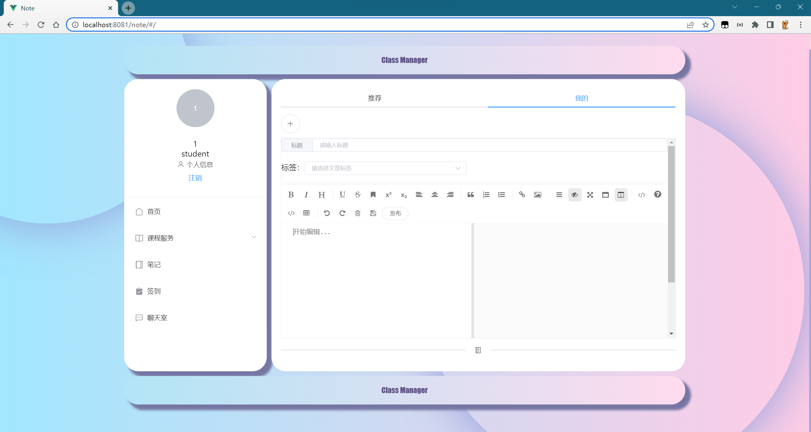

# 课堂管理平台

#### 介绍
基于Spring Boot+Vue的课堂管理系统。前后端分离。包含教师授课管理、学生选退课、聊天室、签到、笔记管理模块。

- 技术栈：Spring Boot+MyBatis+Redis+WebSocket+VueCLI+Axios+Element UI
- 项目特点：
    - 后台使用MyBatis连接数据库，编写后台服务器的请求接口。
    - 整合WebSocket技术，配置聊天端口，将消息信息封装为对象，实现用户发送信息实时转发功能。
    - 使用Redis缓存学生签到记录，学生端签到更新缓存数据，并将数据实时发送至教师端。
    - 前端使用Vue CLI创建运行在Node服务器中，使用Element UI对界面进行布局和设计。
    - 使用Vue Router来配置路由，实现跳转笔记详情传参，引入Mavon-Editor来实现使用MarkDown的语法来编辑笔记。
    - 引入Axios并且配置代理服务器解决跨域请求问题。
    - 使用js-cookie来存储用户登录状态。


#### 文件说明
```
classroom-manager 为后端项目
classroom-manager-front 为前端项目
```
#### 启动教程
1. 导入sql文件。地址：classroom-manager/sql/course_selection.sql
2. 启动后端项目。
3. 启动redis服务。
3. 启动前端项目, 再前端项目文件夹输入 npm run serve
4. 浏览器输入http://localhost:8081/

#### 模块说明
1. 课程管理模块：教师可以添加、编辑、删除课程；学生可以选课、退课。
2. 聊天室：登录的用户进入聊天室，可以查看在线用户列表，实时进行聊天。
3. 签到：教师端可以选择课程发起签到生成一个签到码，学生端若选择了此课程，输入签到码后完成签到，更新状态信息至教师端。
4. 笔记管理：用户可浏览公开的笔记，可MarkDown的语法添加和编辑笔记。

#### 实现效果


